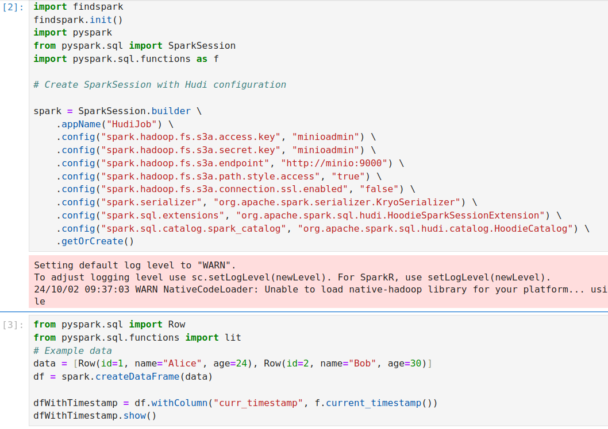
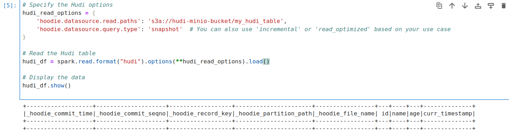
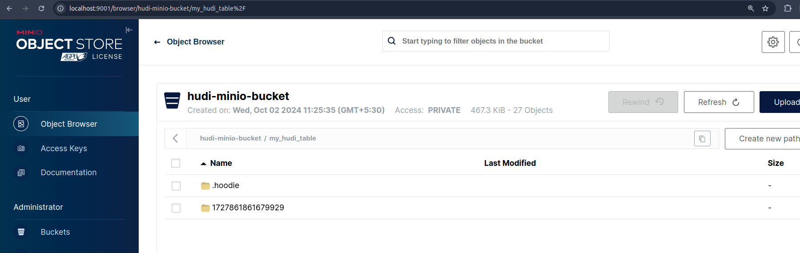

# Apache Hudi on Spark with MinIO Integration


This project demonstrates the integration of Apache Hudi, Apache Spark, and MinIO to build a prototype data lake architecture. 
It allows scalable, efficient, and transactional data management on top of cloud-based object storage.

Note: If you go through `dev.Dockerfile` you will see that there are some COPY instructions are commented out.
That is becuase for the purpose of testing and debugging I downlaod all the tar.gz, zip and jar files in downloads directory
and then I use COPY command to copy these files to the container. This makes my debugging fast as I don't need to download from internet


Existing Issues: 
- Reading table returns empty table, need to fix that. 


### Example Code: 
A very simple test to create a table using pyspark
to check if things are working

```python
import findspark
findspark.init()
import pyspark
from pyspark.sql import SparkSession
import pyspark.sql.functions as f

# Create SparkSession with Hudi configuration

spark = SparkSession.builder \
    .appName("HudiJob") \
    .config("spark.hadoop.fs.s3a.access.key", "minioadmin") \
    .config("spark.hadoop.fs.s3a.secret.key", "minioadmin") \
    .config("spark.hadoop.fs.s3a.endpoint", "http://minio:9000") \
    .config("spark.hadoop.fs.s3a.path.style.access", "true") \
    .config("spark.hadoop.fs.s3a.connection.ssl.enabled", "false") \
    .config("spark.serializer", "org.apache.spark.serializer.KryoSerializer") \
    .config("spark.sql.extensions", "org.apache.spark.sql.hudi.HoodieSparkSessionExtension") \
    .config("spark.sql.catalog.spark_catalog", "org.apache.spark.sql.hudi.catalog.HoodieCatalog") \
    .getOrCreate()
```


```python
from pyspark.sql import Row
from pyspark.sql.functions import lit
# Example data
data = [Row(id=1, name="Alice", age=24), Row(id=2, name="Bob", age=30)]
df = spark.createDataFrame(data)

dfWithTimestamp = df.withColumn("curr_timestamp", f.current_timestamp())
dfWithTimestamp.show()

```

Write to Hudi table in Minio

```python
hudi_options = {
    'hoodie.table.name':'my_hudi_table',
    'hoodie.datasource.write.storage.type': 'COPY_ON_WRITE',
    'hoodie.datasource.write.recordkey.field': 'id',
    'hoodie.datasource.write.precombine.field': 'curr_timestamp',
    'hoodie.datasource.write.partitionpath.field': 'curr_timestamp',  # Consider changing this
    'hoodie.datasource.write.table.name': 'my_hudi_table',
    'hoodie.datasource.hive_sync.enable': 'false',
    'hoodie.datasource.write.operation': 'upsert',
}

# Sample Hudi write code
dfWithTimestamp.write.format("hudi").options(**hudi_options).mode("overwrite").save("s3a://hudi-minio-bucket/my_hudi_table")
```

Read Hudi table from Minio
```python
# Specify the Hudi options
hudi_read_options = {
    'hoodie.datasource.read.paths': 's3a://hudi-minio-bucket/my_hudi_table',
    'hoodie.datasource.query.type': 'snapshot'  # You can also use 'incremental' or 'read_optimized' based on your use case
}

# Read the Hudi table
hudi_df = spark.read.format("hudi").options(**hudi_read_options).load()

# Display the data
hudi_df.show()
```



Read hudi table screenshot:
- Here I see empty table, that seems like issue with write or format issue 
- In below screen I can see data in minio bucket so need to debug this. 


Let's check the bucket content: 
- As we can see in the screenshot below. Table has ben written to bucket.

